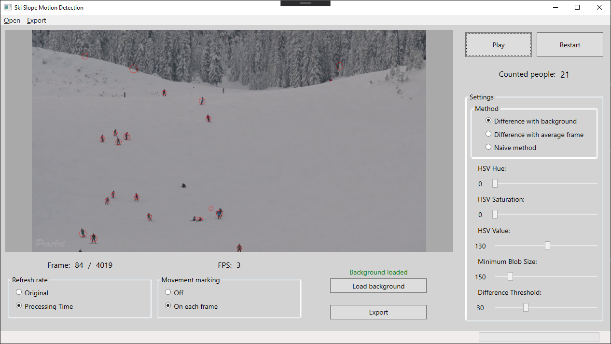

# Ski slope motion detection

Project created for Image Processing classes at the Warsaw University of Technology. 

It utilizes motion detection algorithms to determine the number of people in the given video of ski slope.

## Technology and dependencies
Project developed using _.NET Framework_ with presentation layer implemented in _WPF_.

Dependencies:
- _EmguCV_
- _Accord.Video_
- _OxyPlot_

## Purpose
The purpose was to create an easy-to-use application for managers and users of ski slopes, that allows to determine the number of users in the loaded video. 

Created application also marks the areas with highest density on the histogram that can be exported as a result of the analysis.

## Methods
- Motion Detection and Tracking using Background Subtraction and Consecutive Frames Difference Method
  * Background as the average of multiple frames of source video
  * Background as the picture
- Naive method - detection of dark blobs on consecutive frames
